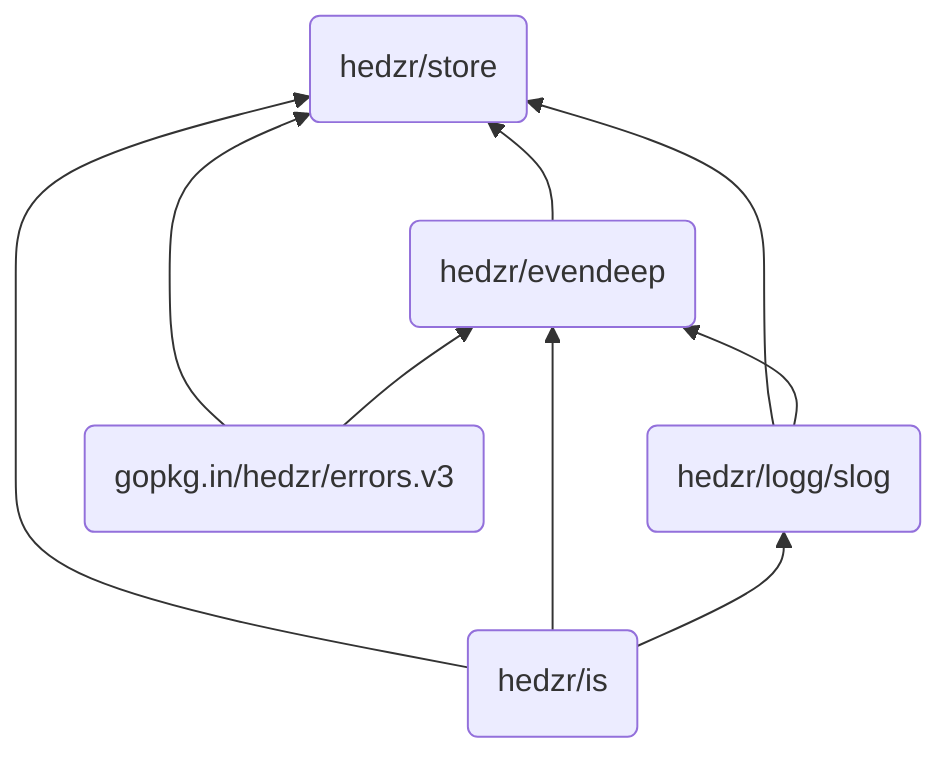

# Store


[](https://github.com/hedzr/store/releases)<!--
[](https://github.com/hedzr/store/releases) -->
[](https://goreportcard.com/report/github.com/hedzr/store)
[](https://coveralls.io/github/hedzr/store?branch=master)
[](https://pkg.go.dev/github.com/hedzr/store)
[](https://deps.dev/go/github.com%2Fhedzr%2Fstore)
[](https://github.com/avelino/awesome-go#configuration)

`hedzr/store` provides an extensible, high-performance configuration management library. It is optimized for accessing hierarchical data.

The special is `put any data and extract typed it`. Which means, the `store` will try to convert the source data within underlying.

Another feature is the `store` traces config items' modification states. So you can extract the changed subset. See also [Modified State](#modified-state).

The `store` is designed to provide the basic skeleton for [hedzr/cmdr v2 (RC1 released)](https://github.com/hedzr/cmdr). It also could be used as a standalone config manager. We split the original config (called as option-store at cmdr v1) and rewrote it. In the refactoring phrase, some excellent config-mgmt/centers get many tips to us, such as [koanf](https://github.com/knadh/koanf) and [viper](https://github.com/spf13/viper). Many respects.

The `store` accesses tree data with a dotted key path, that means you may point to a specified tree node and access it, modify it, monitor it or remove it. You can use a different delimiter char like `/` or `\`.

```go
conf := store.New()
conf.Set("app.debug", false)
conf.Set("app.verbose", true)
conf.Set("app.dump", 3)
conf.Set("app.logging.file", "/tmp/1.log")
conf.Set("app.server.start", 5)

ss := conf.WithPrefix("app.logging")
ss.Set("rotate", 6)
ss.Set("words", []any{"a", 1, false})
ss.Set("keys", map[any]any{"a": 3.13, 1.73: "zz", false: true})

// Tag; Comment & Description
conf.Set("app.bool", "[on,off,   true]")
conf.SetComment("app.bool", "a bool slice", "remarks here")
conf.SetTag("app.bool", []any{"on", "off", true})

// TTL to clear the node data to zero
conf.SetTTL("app.bool", 15 * time.Second, func(_ *radix.TTL[any], nd radix.Node[any]) {
  t.Logf("%q (%q) cleared", "app.bool", nd.Data())
})  // since v1.2.5
defer conf.Close()  // when you used SetTTL, the Close() is must be had.

states.Env().SetNoColorMode(true) // to disable ansi escape sequences in dump output
fmt.Println(conf.Dump())
```

It dumps as (internal data structure):

```text
  app.                          <B>
    d                           <B>
      ebug                      <L> app.debug => false
      ump                       <L> app.dump => 3
    verbose                     <L> app.verbose => true
    logging.                    <B>
      file                      <L> app.logging.file => /tmp/1.log
      rotate                    <L> app.logging.rotate => 6
      words                     <L> app.logging.words => [a 1 false]
      keys                      <L> app.logging.keys => map[a:3.13 1.73:zz false:true]
    server.start                <L> app.server.start => 5
    bool                        <L> app.bool => [on,off,   true] // remarks here | tag = [on off true] ~ a bool slice
```

As you seen, the internal structure will be printed out for the deep researching.


> `<B>` is branch, `<L>` is leaf.
>
> Leaf node contains data, comment, description and tag (any value).
>
> To speed up the tree, any delimiter char is a part of the path.

The `store` provides advanced APIs to extract the typed data from some a node,

```go
iData := conf.MustInt("app.logging.rotate")
stringData := conf.MustString("app.logging.rotate")
debugMode := conf.MustBool("app.debug")
...
```

The searching tools are also used to locate whether a key exists or not:

```go
found := conf.Has("app.logging.rotate")
node, isBranch, isPartialMatched, found := conf.Locate("app.logging.rotate")
t.Logf("%v | %s | %v |     | %v, %v, found", node.Data(), node.Comment(), node.Tag(), isBranch, isPartialMatched, found)
```

`Locate` is a more friendly `Has` test for the developers when they want to inspect more extra information after searching.

For more information, browse these public sites:

- <https://pkg.go.dev/github.com/hedzr/store>
- <https://github.com/hedzr/store>
- Check out the codes in test source files

To see the recently changes at [CHANGELOG](https://github.com/hedzr/store/blob/master/CHANGELOG).

> Since v1.1.0, unexported struct ptr (*storeS) removed from `Store` API.
>
> These apis changed to:
>
> - `Clone() (newStore Store)`
> - `Dup() (newStore Store)`
> - `WithPrefix(prefix ...string) (newStore Store)`
> - `WithPrefixReplaced(newPrefix ...string) (newStore Store)`
>
> Since v1.2.0, the prototypes of `Locate`/`Query` are changed.
>
> - an extra `kvpair` will be returned if there is `:ident` in trie path and matched ok.
> - support these url var matching: "/:id/", "/*filepath"
>
> For example, matching `/hello/bob` on a router path pattern `/hello/:name` will get `kvpair = {"name":"bob"}`, and `/search/any/thing/here` on pattern `/search/*keywords` will get `kvpair = {"keywords":"any/thing/here"}`.
>
> Since v1.2.5, `SetTTL` added.

Using [hedzr/store](https://github.com/hedzr/store) as a in-memory Cache provider is possible. Since v1.2.5 we added `SetTTL` to reset the data of a node (by key) to zero value. You can inject your codes to drop the key or whatever else.

## More Features

The `store` gives many advanced features from out of the box, but the relative documents are not enough. We will try our best to fill more documentation at a certain point in the future.

In short, the `store` can load the data from a provider which will load from its external source, which data will be decoded by a codec decoder.

Once your configuration data is loaded or inserted into the store manually, you can read them at any time, in any way.
That is, the original items can be extracted with a different data type if they can convert smoothly. For example, a string item `3d3h3s` can be got as a `time.Duration` value (via `MustDuration(path)`).

### Retrieve Node Data

A config entry, so-called as a node (in our Trie-tree), can be retrieved as a typed value:

```go
func ExampleStoreS_Get() {
    trie := newBasicStore()
    fmt.Println(trie.MustInt("app.dump"))
    fmt.Println(trie.MustString("app.dump"))
    fmt.Println(trie.MustBool("app.dump")) // convert 3 to bool will get false, only 1 -> true.
    // Output:
    // 3
    // 3
    // false
}

func newBasicStore(opts ...Opt) *storeS {
    conf := New(opts...)
    conf.Set("app.debug", false)
    conf.Set("app.verbose", true)
    conf.Set("app.dump", 3)
    conf.Set("app.logging.file", "/tmp/1.log")
    conf.Set("app.server.start", 5)

    ss := conf.WithPrefix("app.logging")
    ss.Set("rotate", 6)
    ss.Set("words", []any{"a", 1, false})
    return conf
}
```

### Extract A Subset

`GetM(path, opts...) map[string]any` is a power tool to extract the nodes as a map, which has the flattened keys. The extracted result looks like:

```bash
store_test.go:150: whole tree: map[app.debug:false app.dump:3 app.logging.file:/tmp/1.log app.logging.rotate:6 app.logging.words:[a 1 false] app.server.start:5 app.verbose:true]
store_test.go:160: app.logging sub-tree: map[app.logging.file:/tmp/1.log app.logging.rotate:6 app.logging.words:[a 1 false]]
```

The test code is:

```go
func TestStore_GetM(t *testing.T) {
    conf := newBasicStore()

    m, err := conf.GetM("")
    if err != nil {
        t.Fatalf("wrong in calling GetM(\"\"): %v", err)
    }
    t.Logf("whole tree: %v", m)

    // filter by a functor

    m, err = conf.GetM("", WithFilter[any](func(node radix.Node[any]) bool {
        return strings.HasPrefix(node.Key(), "app.logging.")
    }))
    if err != nil {
        t.Fatalf("wrong in calling GetM(\"\"): %v", err)
    }
    t.Logf("app.logging sub-tree: %v", m)
}
```

`GetM("")` can extract the whole tree, and `GetM("app.logging")` extract that subtree.

With filter functor, you can extract `app.logging` subtree by `GetM("", WithFilter[any](func(node radix.Node[any]) bool {
    return strings.HasPrefix(node.Key(), "app.logging.")
})))`.

### Extract Subtree Into Struct

`GetSectionFrom` makes extracting to struct easier. For example,

```go
func TestStore_GetSectionFrom(t *testing.T) {
    conf := newBasicStore()
    conf.Set("app.logging.words", []any{"a", 1, false})
    conf.Set("app.server.sites", -1)
    t.Logf("\nPath\n%v\n", conf.Dump())

    type loggingS struct {
        File   uint
        Rotate uint64
        Words  []any
    }

    type serverS struct {
        Start int
        Sites int
    }

    type appS struct {
        Debug   int
        Dump    int
        Verbose int64
        Logging loggingS
        Server  serverS
    }

    type cfgS struct {
        App appS
    }

    var ss cfgS
    err := conf.GetSectionFrom("", &ss) // extract the whole tree
    t.Logf("cfgS: %v | err: %v", ss, err)

    assertEqual(t, []any{"a", 1, false}, ss.App.Logging.Words)
    assertEqual(t, -1, ss.App.Server.Sites)

    if !reflect.DeepEqual(ss.App.Logging.Words, []any{"a", 1, false}) {
        t.Fail()
    }
}
```

> TODO: Transferring a struct into the `Store` isn't in our plan yet.

### Light-weight Sub-tree

The `store` has a dead lightweight subtree accessor. By using `WithPrefix` or `WithPrefixReplaced`, you can construct a subtree accessor and read/write a node:

```go
func TestStore_WithPrefix(t *testing.T) {
    trie := newBasicStore()
    t.Logf("\nPath\n%v\n", trie.Dump())

    assertEqual(t, 6, trie.MustGet("app.logging.rotate"))
    conf := trie.WithPrefix("app")
    assertEqual(t, 6, conf.MustGet("logging.rotate"))
  
    conf = conf.WithPrefix("logging")
    assertEqual(t, 6, conf.MustGet("rotate"))
    
  conf = trie.WithPrefixReplaced("app.logging")
    assertEqual(t, 6, conf.MustGet("rotate"))
}
```

### Easily Cutting

By using `SetPrefix(prefix)`, a `store` and its whole subtree can be moved or associated with a new hierarchical tree structure.

By using `Dup` or `Clone`, and `Merge`, the `store` can be cut and layout.

### Split key with delimiter

If a key contains delimiter, it will be split and insert into the `Store`. Technically, the inserter doesn't do special stuff for this key, but the getter will access the tree path separated by the delimiter char.

So when you're loading a YAML file (or others), the dotted key can make the file consicer:

```yaml
app.demo.working: "~/demo"
```

It equals

```yaml
app:
  demo:
    working: "~/demo"
```

This feature is builtin and cannot disable, due to we have a Trie-tree store and the node is always recognized at extracting.

A side effect is when you're using a float-point number as a key, that will have matters. Our tip is, don't do that.

### Decompound Map

The data can be split and orchestrated into tree structure when you're inserting a map.

This feature works when a provider is loading its external source. `Set(k, v)` doesn't decompound anything in `v`. But `Merge(k, m)` does:

```go
func TestDecompoundMap(t *testing.T) {
    conf := newBasicStore()

    conf.Set("app.map", false) // ensure key path 'app.map' has already existed
    // and now merge a map into the point/node
    err := conf.Merge("app.map", map[string]any{
        "k1": 1,
        "k2": false,
        "m3": map[string]any{
            "bobo": "joe",
        },
    })

    if err != nil {
        t.Fatalf("Merge failed: %v", err)
    }

    assert.Equal(t, int(1), conf.MustGet("app.map.k1"))
    assert.Equal(t, false, conf.MustGet("app.map.k2"))
    assert.Equal(t, "joe", conf.MustGet("app.map.m3.bobo"))
}
```

Of course, it shall be a valid deep `map[string]any`.

### Decompound Slice

A slice can be decompounded once you enabled `WithStoreFlattenSlice(true)`.

It works for loading an external source, similar like Decompounding Map.

<details><summary>See the sample code for collapsed sections</summary>

For example:

```go
func TestHjson(t *testing.T) {
    s := store.New()
    parser := hjson.New()
    if err := s.Load(context.TODO(),
        store.WithStorePrefix("app.hjson"),
        store.WithCodec(parser),
        store.WithProvider(file.New("../testdata/6.hjson")),

        store.WithStoreFlattenSlice(true),
    ); err != nil {
        t.Fatalf("Load failed: %v", err)
    }
    t.Logf("\n%-32sData\n%v\n", "Path", s.Dump())

    assert.Equal(t, `r.Header.Get("From")`, s.MustGet("app.hjson.messages.0.placeholders.0.expr"))
    assert.Equal(t, `r.Header.Get("User-Agent")`, s.MustGet("app.hjson.messages.1.placeholders.0.expr"))
}
```

The supplied hjson file has the following contents:

```json5
{
  "language": "zh",
  "messages": [
    {
      "id": "Hello {From}!",
      "message": "Hello {From}!",
      "translation": "",
      "placeholders": [
        {
          "id": "From",
          "string": "%[1]s",
          "type": "string",
          "underlyingType": "string",
          "argNum": 1,
          "expr": "r.Header.Get(\"From\")"
        }
      ]
    },
    {
      "id": "Do you like your browser ({User_Agent})?",
      "message": "Do you like your browser ({User_Agent})?",
      "translation": "",
      "placeholders": [
        {
          "id": "User_Agent",
          "string": "%[1]s",
          "type": "string",
          "underlyingType": "string",
          "argNum": 1,
          "expr": "r.Header.Get(\"User-Agent\")"
        }
      ]
    }
  ]
}
```

</details>

### Notable Nodes

Different from other configuration managers, the store is not only a memory key-value store. The nodes in store are both notable and taggable.

```go
conf.Set("debug", false)
conf.SetComment("debug", "a flag to identify app debug mode", "remarks here")
conf.SetTag("debug", map[string]any{
    "handler": func(){},
})

node, _, _, found := conf.Locate("debug")
if found {
    t.Log(node.Tag(), node.Description(), node.Comment())
}
t.Log(conf.Dump())
```

`Dump()` will produce the detailed output.


### Walk The Whole Tree

`Walk(path)` gives a way to iterator the `Store`.

```go
func TestStore_Walk(t *testing.T) {
    var conf Store = newBasicStore()
    conf.Walk("", func(path, fragment string, node radix.Node[any]) {
        t.Logf("%v / %v => %v", path, fragment, node)
    })
}

// Output:
//  /  => &{[]  [0xc0000e23f0] <nil>   <nil> 0}
// app. / app. => &{[97 112 112 46] app. [0xc0000e2480 0xc0000e2510 0xc0000e26c0 0xc0000e2750] false   <nil> 0}
// app.d / d => &{[100] app.d [0xc0000e25a0 0xc0000e2630] false   <nil> 0}
// app.debug / ebug => &{[101 98 117 103] app.debug [] false   <nil> 13}
// app.dump / ump => &{[117 109 112] app.dump [] 3   <nil> 13}
// app.verbose / verbose => &{[118 101 114 98 111 115 101] app.verbose [] true   <nil> 13}
// app.logging. / logging. => &{[108 111 103 103 105 110 103 46] app.logging. [0xc0000e2870 0xc0000e2900 0xc0000e2990] /tmp/1.log   <nil> 0}
// app.logging.file / file => &{[102 105 108 101] app.logging.file [] /tmp/1.log   <nil> 13}
// app.logging.rotate / rotate => &{[114 111 116 97 116 101] app.logging.rotate [] 6   <nil> 13}
// app.logging.words / words => &{[119 111 114 100 115] app.logging.words [] [a 1 false]   <nil> 13}
// app.server.start / server.start => &{[115 101 114 118 101 114 46 115 116 97 114 116] app.server.start [] 5   <nil> 13}
```

As a feature based on Trie-tree, `Walk("app")` will walk from the parent of `app.` node. And `Walk("app.")` will walk from the `app.` node.

Like `GetM`, passing "" will walk from the top-level root node.

### Modified State

Each node has a modified state, so we can extract them from the `Store`:

```go
func (s *loadS) Save(ctx context.Context) (err error) { return s.trySave(ctx) }
func (s *loadS) trySave(ctx context.Context) (err error) {
    if s.codec != nil {
        var m map[string]any
        if m, err = s.GetM("", WithFilter[any](func(node radix.Node[any]) bool {
            return node.Modified()
        })); err == nil {
            var data []byte
            if data, err = s.codec.Marshal(m); err == nil {
                switch fp := s.provider.(type) {
                case OnceProvider:
                    err = fp.Write(data)
                default:
                    err = ErrNotImplemented
                }

                if errors.Is(err, ErrNotImplemented) {
                    if wr, ok := s.provider.(io.Writer); ok {
                        _, err = wr.Write(data)
                    }
                }
            }
        }
    }
    return
}
```

We assume the user calling `Set(k, v)` will cause modified state was set to true. And app loading and merging to the `Store` at startup will be treated as initial state, so the modified state keeps unset (i.e., false).

### Provider for External Source

`Provider`s could be used to describe an external source, such as file, env, or consul and vice versa.

`Codec`s are used to describe how to decode a streaming input loaded by Provider, such as yaml, toml, json, hcl, etc.

A loading logic typically is:

```go
func TestTOML(t *testing.T) {
    s := store.New()
    parser := toml.New()
    if err := s.Load(context.TODO(),
        store.WithStorePrefix("app.toml"),
        store.WithCodec(parser),
        store.WithProvider(file.New("../testdata/5.toml")),

        store.WithStoreFlattenSlice(true),
    ); err != nil {
        t.Fatalf("Load failed: %v", err)
    }
    t.Logf("\n%-32sData\n%v\n", "Path", s.Dump())

    assert.Equal(t, `127.0.0.1`, s.MustGet("app.toml.host"))
    assert.Equal(t, `TLS 1.3`, s.MustGet("app.toml.TLS.version"))
    assert.Equal(t, `AEAD-AES128-GCM-SHA256`, s.MustGet("app.toml.TLS.cipher"))
    assert.Equal(t, `go`, s.MustGet("app.toml.tags.0"))
}
```

More tests at [tests/*_test.go](./tree/master/tests/) .

### Implement A Provider

A `Provider` should support `Read()`:

```go
type Provider interface {
    Read() (m map[string]any, err error) // return ErrNotImplemented as an identifier

    ProviderSupports
}

type ProviderSupports interface {
    GetCodec() (codec Codec)   // return the bound codec decoder
    GetPosition() (pos string) // return a position pointed to a trie node path
    WithCodec(codec Codec)
    WithPosition(pos string)
}
```

Your provider can support `OnceProvider` or `StreamProvider` while its `Read` return `radix.ErrNotImplemented`. OnceProvider assumes the loader read binary content at once. `StreamProvider` allows reading the large content progressively.

### Set TTL for A Key

Since v1.2.5, we added TTL support for a trie node. Once the TTL arrives, the data of the target key will be cleared. Which means, the data field would be reset to zero value (or a nil value for an any type T).

The code could be:

```go
func TestStore_SetTTL(t *testing.T) {
	conf := newBasicStore()
	defer conf.Close()

	path := "app.logging.rotate"
	conf.SetTTL(path, 200*time.Millisecond, func(s *radix.TTL[any], nd radix.Node[any]) {
		t.Logf("%q cleared", path)
	})
	path2 := "app.logging.file"
	conf.SetTTL(path2, 200*time.Millisecond, func(s *radix.TTL[any], nd radix.Node[any]) {
		t.Logf("%q (%q) cleared", path2, nd.Data())
	})

	time.Sleep(450 * time.Millisecond)
	assertEqual(t, true, conf.Has(path2))
	assertEqual(t, nil, conf.MustGet(path2))
	assertEqual(t, 0, conf.MustInt(path))
}
```


## Benchmarks

The `store` is designed to reduce the allocations much better, and up the performance much better. We have a zero-allocation implementation in reading a key-value pair, currently.

Our benchmark testing (`test/bench_test.go`) shows:

```bash
goos: darwin
goarch: amd64
pkg: github.com/hedzr/store/tests
cpu: Intel(R) Core(TM) i9-9880H CPU @ 2.30GHz
BenchmarkTrieSearch
BenchmarkTrieSearch/hedzr/storeT[any]
BenchmarkTrieSearch/hedzr/storeT[any]-16             59983291            18.99 ns/op           0 B/op           0 allocs/op
BenchmarkTrieSearch/hedzr/store
BenchmarkTrieSearch/hedzr/store-16                   60454639            19.43 ns/op           0 B/op           0 allocs/op
PASS
```

Some control groups with the same executive environment produced:

```bash
...
BenchmarkTrieSearch/kzzzz
BenchmarkTrieSearch/kzzzz-16                         46264582            28.88 ns/op          16 B/op           1 allocs/op
BenchmarkTrieSearch/vzzzz
BenchmarkTrieSearch/vzzzz-16                         22824562            51.21 ns/op          32 B/op           2 allocs/op
...
```

> 1. To avoid controversy, pkg-name masked.
>
> 2. Both of these testing data sets have the same scale basically (lower than 20 keys). Also, the querying words are same.
>
>    
>
> 3. No Warrenties.

The performance benefits mainly from the refresh implemented about our internal Trie-tree (radix-tree).

As an addition, here are huger/larger benches:

```bash
    bench_test.go:82: kxxxx/Large keys: 40 keys
    bench_test.go:52: store/Large keys: 48 keys
    bench_test.go:24: kxxxx/Huge keys: 318 keys
    bench_test.go:26: store/Huge keys: 422 keys

BenchmarkTrieSearch/hedzr/store
BenchmarkTrieSearch/hedzr/store-16               	57905116	        20.23 ns/op	       0 B/op	       0 allocs/op
BenchmarkTrieSearch/hedzr/store/Large
BenchmarkTrieSearch/hedzr/store/Large-16         	12816524	        82.66 ns/op	     240 B/op	       0 allocs/op
BenchmarkTrieSearch/hedzr/store/Huge
BenchmarkTrieSearch/hedzr/store/Huge-16          	12987994	        89.08 ns/op	     224 B/op	       0 allocs/op
BenchmarkTrieSearch/kxxxx
BenchmarkTrieSearch/kxxxx-16                     	64279840	        19.54 ns/op	       7 B/op	       0 allocs/op
BenchmarkTrieSearch/kxxxx/Large
BenchmarkTrieSearch/kxxxx/Large-16               	 1476079	       838.0 ns/op	     710 B/op	      18 allocs/op
BenchmarkTrieSearch/kxxxx/Huge
BenchmarkTrieSearch/kxxxx/Huge-16                	 1678077	       739.9 ns/op	     441 B/op	      12 allocs/op
```

You can find out that our `store` has a better score while working on a large configuration set,
although it might take more latency than on a tiny set.

> The datasource of huge test is a pet-store openapi swagger doc, coming from <https://editor.swagger.io/>.
> With a same input like a YAML file, the `store` could get more key-value pairs because `store.WithStoreFlattenSlice(true)` applied, which will expand slices and maps in a value as nested key-value pairs.

So that's it.

## Dependencies

The `store`[^1] imports some modules of mine:

1. [`hedzr/evendeep`[^2]]
2. [`hedzr/logg/slog`[^3]]
3. [`hedzr/errors.v3`[^4]]
4. [`hedzr/is`[^5]]

The dependency graph is:



[^1]: `hedzr/store` is a high-performance configure management library
[^2]: `hedzr/evendeep` offers a customizable deepcopy tool to you. There are also deepequal, deepdiff tools in it.
[^3]: `hedzr/logg` provides a slog like and colorful logging library
[^4]: `hedzr/errors.v3` provides some extensions and compatible layer over go1.11 ~ nowadays.
[^5]: `hedzr/is` is a basic environ detectors library

## LICENSE

Apache 2.0
